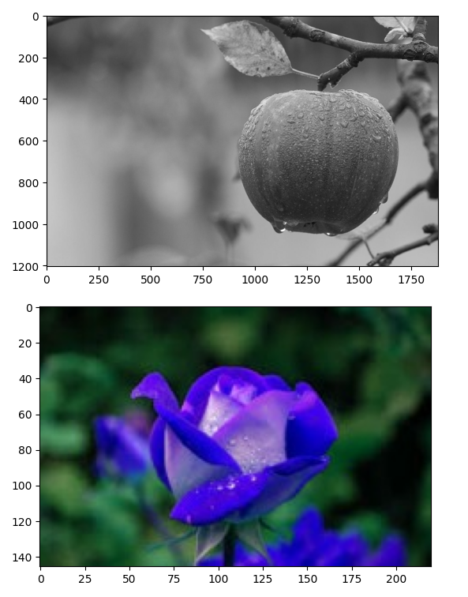
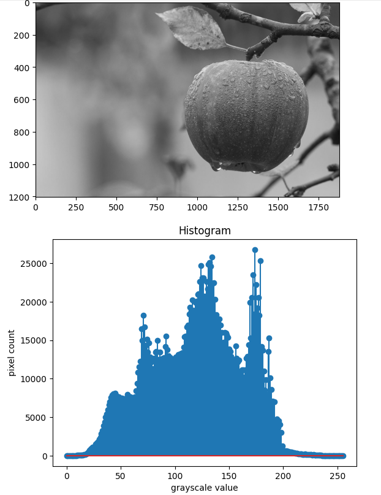
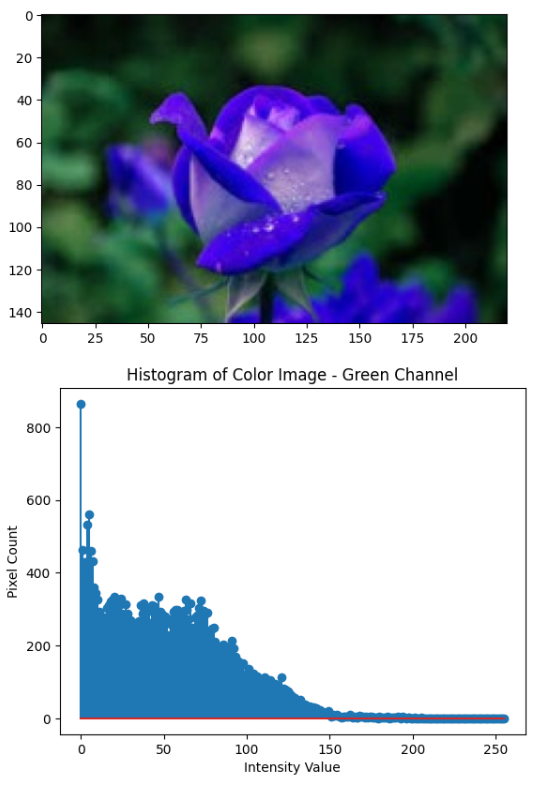
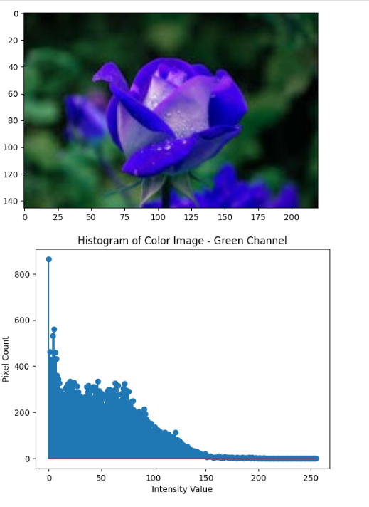

# Histogram-of-an-images
## Aim
To obtain a histogram for finding the frequency of pixels in an Image with pixel values ranging from 0 to 255. Also write the code using OpenCV to perform histogram equalization.

## Software Required:
Anaconda - Python 3.7

## Algorithm:
### Step1:
Read the gray and color image using imread()

### Step2:
Print the image using imshow().


### Step3:
Use calcHist() function to mark the image in graph frequency for gray and color image.

### step4:
Use calcHist() function to mark the image in graph frequency for gray and color image.

### Step5:
The Histogram of gray scale image and color image is shown.


## Program:
```
Developed By:Shaik Shoaib Nawaz
Register Number:212222240094 

## Input Grayscale Image and Color Image:

import cv2
import matplotlib.pyplot as plt
gray_image = cv2.imread("gray image of flower.jpg")
color_image = cv2.imread()
cv2.imshow("Gray Image",gray_image)

cv2.waitKey(0)
cv2.destroyAllWindows()


##  Histogram of Grayscale Image and any channel of Color Image:

import matplotlib.pyplot as plt 
grayscale_image=cv2.imread("gray image of flower.jpg")
colourscale_image=cv2.imread("color image of flower.jpg")
hist=cv2.calcHist(grayscale_image,[0],None,[255],[0,255])
hist1=cv2.calcHist()
plt.figure()
plt.title("Histogram")
plt.xlabel("")
plt.ylabel("pixel count")
plt.stem()
plt.show()

## Histogram Equalization of Grayscale Image

import cv2
import matplotlib.pyplot as plt 
gi=cv2.imread("gray image of flower.jpg",0)
colorscale=cv2.imread("color image of flower.jpg")
g=cv2.resize(gi,(500,400))
equ=cv2.equalizeHist(gi)
```
## Output:
### Input Grayscale Image and Color Image:



### Histogram of Grayscale Image and any channel of Color Image:




### Histogram Equalization of Grayscale Image.


 

## Result: 
Thus the histogram for finding the frequency of pixels in an image with pixel values ranging from 0 to 255 and also,histogram equalization is successfully done for the gray scale image using OpenCV.
